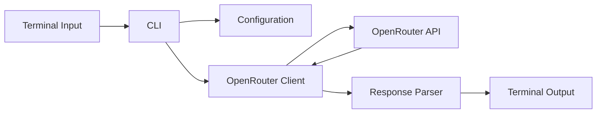

# OpenRouter TypeScript CLI

> A modular TypeScript command-line application for sending prompts to OpenRouter, inspecting API metadata, and presenting source-aware model responses.

[](LICENSE)
[](tsconfig.json)
[](package.json)
[](#project-status)

## Overview

โปรเจกต์นี้เป็นตัวอย่างเชิงวิชาชีพสำหรับเรียนรู้การพัฒนา AI CLI Application ด้วย **TypeScript + Node.js + OpenRouter API** โดยแยกความรับผิดชอบของระบบออกเป็นโมดูล ได้แก่ configuration, prompt, API client, response parser, output และ interactive CLI

ระบบรองรับการรับคำถามจาก Terminal การส่งคำขอไปยัง OpenRouter การแสดงสถานะ HTTP ระยะเวลาตอบกลับ รุ่นโมเดล token usage และแหล่งอ้างอิงที่โมเดลระบุ พร้อม fallback ที่ไม่กล่าวอ้างว่ามีแหล่งข้อมูลเมื่อ response ไม่ตรงตามสัญญา JSON

## Features

- Interactive terminal loop with `exit`, `quit`, and `:q` commands
- Centralized environment configuration with validation
- Configurable model, endpoint, timeout, token limit, and temperature
- Request timeout through `AbortController`
- Safe handling of JSON, non-JSON, empty, API-error, and network-error responses
- Runtime validation of the source-aware answer structure
- Response metadata: HTTP status, response time, model, generation ID, finish reason, and token usage
- Clear separation between model answer, claimed sources, and source limitations
- Strict TypeScript configuration and ESM-compatible imports

## Architecture



## Project Structure

```text
.
├── src/
│   ├── index.ts              # Application bootstrap
│   ├── cli.ts                # Interactive terminal loop
│   ├── config.ts             # Environment loading and validation
│   ├── openrouter-client.ts  # HTTP client and error handling
│   ├── output.ts             # Terminal presentation
│   ├── parser.ts             # Source-aware response parsing
│   ├── prompts.ts            # System prompt contract
│   └── types.ts              # Shared TypeScript types
├── .env.example
├── .gitignore
├── package.json
├── package-lock.json
├── tsconfig.json
├── LICENSE
└── README.md
```

## Requirements

- Node.js version compatible with the dependencies declared in `package-lock.json`
- npm
- An OpenRouter API key

## Installation

```bash
git clone https://github.com/PhuminDecOKnoi/OpenRouter-TypeScript-CLI.git
cd OpenRouter-TypeScript-CLI
npm ci
cp .env.example .env
```

Add the real API key to `.env`:

```dotenv
OPENROUTER_API_KEY=your_real_key_here
```

Never commit `.env` or expose an API key in screenshots, logs, issues, or source files.

## Configuration

| Variable | Required | Default |
|---|---:|---|
| `OPENROUTER_API_KEY` | Yes | None |
| `OPENROUTER_API_URL` | No | OpenRouter chat-completions endpoint |
| `OPENROUTER_MODEL` | No | `openrouter/free` |
| `OPENROUTER_APP_TITLE` | No | `OpenRouter TypeScript CLI` |
| `OPENROUTER_APP_REFERER` | No | `http://localhost` |
| `OPENROUTER_MAX_TOKENS` | No | `700` |
| `OPENROUTER_TEMPERATURE` | No | `0.2` |
| `OPENROUTER_TIMEOUT_MS` | No | `60000` |

Model availability, routing, pricing, quotas, and provider behaviour may change. Verify operational settings in the relevant provider documentation before production use.

## Usage

Development mode:

```bash
npm run dev
```

Build and run compiled output:

```bash
npm run build
npm start
```

## Response Contract

The system prompt requests JSON containing:

- `answer`
- `sources[]`
- optional `source_warning`

This is a model instruction, not a guarantee. The parser validates the minimum response shape and falls back to an `unknown` source when the model returns invalid or unstructured content.

## Error Handling

The API layer distinguishes:

- HTTP/API errors
- request timeout
- network failure
- non-JSON provider response
- empty model content
- invalid source-aware answer structure

Errors are returned as structured application results so the CLI can display them consistently without exposing the API key.

## Security and Reliability

- Store secrets only in local environment variables.
- Do not trust model-provided citations without independent verification.
- Do not use the output as the sole basis for legal, medical, financial, employment, security, or other high-impact decisions.
- Review model cost and token limits before increasing `OPENROUTER_MAX_TOKENS`.
- Treat external response content as untrusted data.

## Project Status

This repository is an educational and development baseline. It demonstrates professional structure and defensive API handling, but it has not been represented as production-certified or independently security-audited.

## License

Licensed under the [MIT License](LICENSE).

## Maintainer

Maintained by [Phumin Decoknoi (`PhuminDecOKnoi`)](https://github.com/PhuminDecOKnoi).
